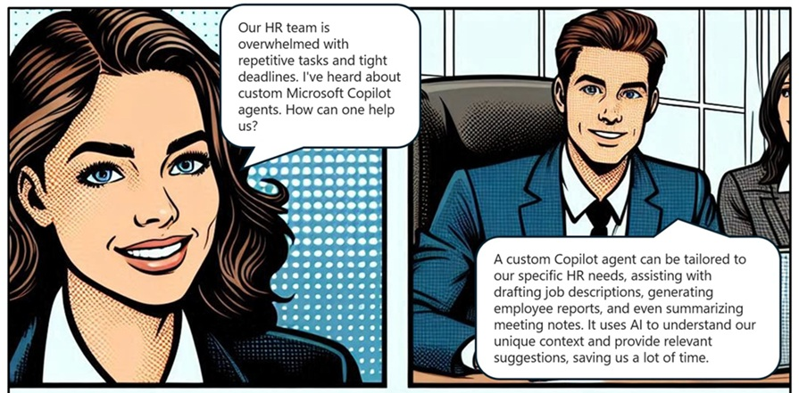
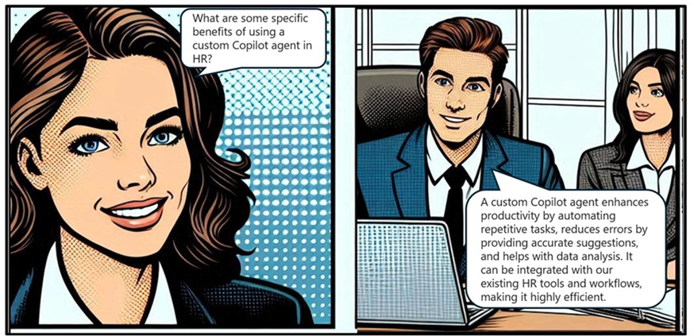

# Enhancing HR Efficiency with a Custom Microsoft Copilot Agent

## Introduction
In today's fast-paced work environment, enhancing productivity and streamlining HR tasks is crucial. A custom Microsoft Copilot agent can be tailored to meet specific HR needs, helping with various tasks, from drafting job descriptions to generating employee reports. This case study explores the importance of a custom Copilot agent in boosting HR productivity, reducing workload, and improving efficiency. Through a detailed analysis of a real-world scenario, we will understand how a custom Copilot agent can be effectively implemented to support HR goals and enhance user experience.

**Tips for Trainers:** Play this comic-style play, scene-by-scene, while asking questions in between scenes to initiate classroom discussions.
 
**Characters Introduction:** This is a conversation between Sarah - an HR manager, and David - an IT consultant, discussing the implementation of a custom Microsoft Copilot agent in their HR department.

**Scene 1:**

**Questions to Learners:** How would you respond if you were the IT consultant?

**Scene 2:**

**Tips for Trainers:** Discuss a few other benefits of a custom Copilot agent in HR:
Automates routine HR tasks like scheduling interviews.
Provides intelligent suggestions for job descriptions.
Enhances data analysis for employee performance reviews.
Improves document accuracy with HR-specific templates.
Saves time and effort by understanding unique HR workflows.
Integrates seamlessly with existing HR tools.
Supports collaboration with custom features.
Increases efficiency by addressing specific HR pain points.
Reduces workload with tailored automation.
Enhances user experience with personalized interactions.

**Scene 3:**

**Tips for Trainers:** Discuss and share these references.

Frequently asked questions about Copilot:
https://learn.microsoft.com/en-us/copilot/faq

Tutorial on Copilot: 
https://learn.microsoft.com/en-us/copilot/
