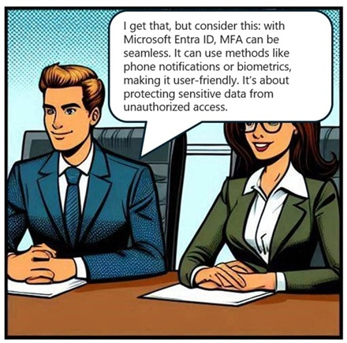
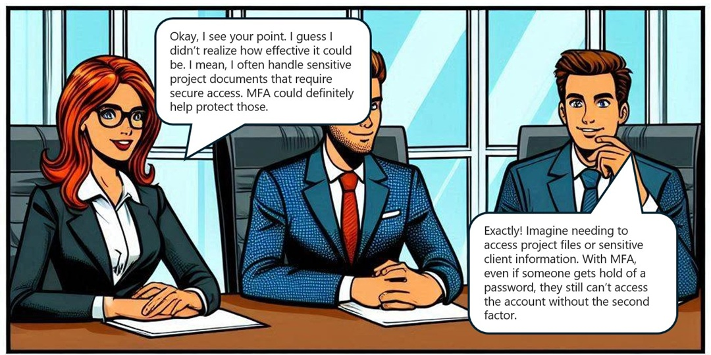

# Need for Multi Factor Authentication

## Introduction
In today's digital age, securing sensitive information has become more critical than ever. Multi-Factor Authentication (MFA) is a security measure that requires users to provide multiple forms of verification before accessing an account or system. This case study explores the importance of MFA in enhancing security, reducing the risk of unauthorized access, and protecting against various cyber threats. Through a detailed analysis of a real-world scenario, we will understand how MFA can be effectively implemented to safeguard organizational data and ensure compliance with regulatory requirements.

**Tips for Trainers:** Play this comic-style play, scene-by-scene, while asking questions in between scenes to initiate classroom discussions .
 
**Characters Introduction:** This is a conversation between Alice - a program manager and John - a security consultant, over the mandatory multifactor authentication for Azure Sign-in in Contoso.

**Scene 1:**

**Questions to Learners:** How would you respond, if you were a security consultant?

**Scene 2:**

**Tips for Trainers:** Discuss on few other benefits of MFA:
Enhances security by requiring multiple forms of verification.
Reduces the risk of unauthorized access.
Protects against phishing attacks.
Safeguards sensitive data.
Increases user confidence in system security.
Complies with regulatory requirements.
Provides an additional layer of defense.
Helps prevent identity theft.
Supports secure remote access.
Mitigates the impact of compromised passwords.

**Scene 3:**

**Tips for Trainers:** Discuss and share these references.

Frequently asked questions about Microsoft Entra multifactor authentication:
https://learn.microsoft.com/entra/identity/authentication/multi-factor-authentication-faq

Tutorial on enabling MFA in Entra ID: 
https://learn.microsoft.com/entra/identity/authentication/tutorial-enable-azure-mfa

Multifactor Authentication Deployment Guide:
https://learn.microsoft.com/entra/identity/authentication/howto-mfa-getstarted
