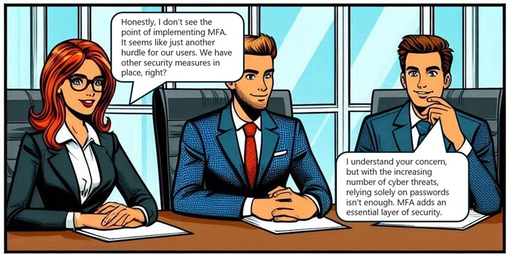

Tips for Trainers: Play this comic-style play, scene-by-scene, while asking questions in between scenes to initiate classroom discussions .
 
Characters Intro: This is a conversation between Alice - a program manager and John - a security consultant, over the mandatory multifactor authentication for Azure Sign-in in Contoso.

Scene 1:

Questions to Learners: How would you respond, if you were a security consultant?

Scene 2:

<image>

Tips for Trainers: Discuss on few other benefits of MFA:
Enhances security by requiring multiple forms of verification[1].
Reduces the risk of unauthorized access[1].
Protects against phishing attacks[1].
Safeguards sensitive data[1].
Increases user confidence in system security[1].
Complies with regulatory requirements[1].
Provides an additional layer of defense[1].
Helps prevent identity theft[1].
Supports secure remote access[1].
Mitigates the impact of compromised passwords[1].
References: [1] What is: Multifactor Authentication - Microsoft Support

Scene 3:

<image>

Tips for Trainers: Discuss and share these references.
Frequently asked questions about Microsoft Entra multifactor authentication:
https://learn.microsoft.com/entra/identity/authentication/multi-factor-authentication-faq
Tutorial on enabling MFA in Entra ID: 
https://learn.microsoft.com/entra/identity/authentication/tutorial-enable-azure-mfa
Multifactor Authentication Deployment Guide:
https://learn.microsoft.com/entra/identity/authentication/howto-mfa-getstarted
