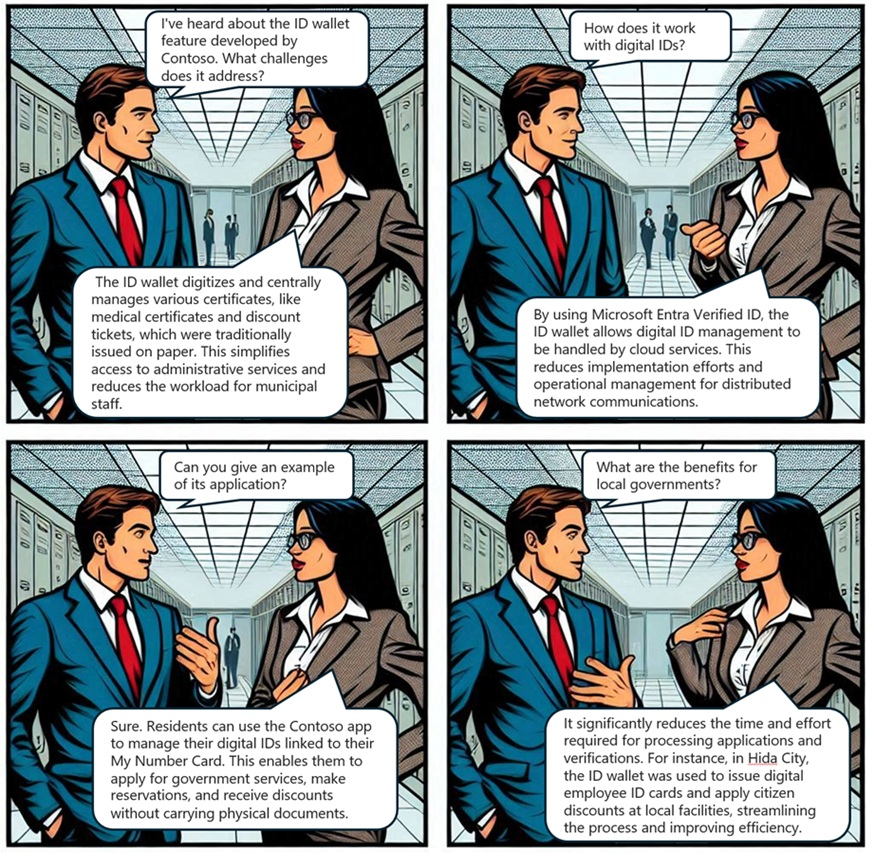

# Microsoft Entra Verified ID in Municpal Services

## Introduction
In this dialog, a developer and an architect discuss the innovative ID wallet feature developed by Contoso, Inc. using Microsoft Entra Verified ID. They explore how this solution addresses the challenges faced by municipalities in managing paper certificates and administrative services. The conversation highlights the benefits of digitizing and centrally managing various certificates, the role of cloud services in reducing operational efforts, and the positive impact on both residents and local government efficiency. Through this discussion, the transformative potential of digital ID management in enhancing public services is clearly demonstrated.

