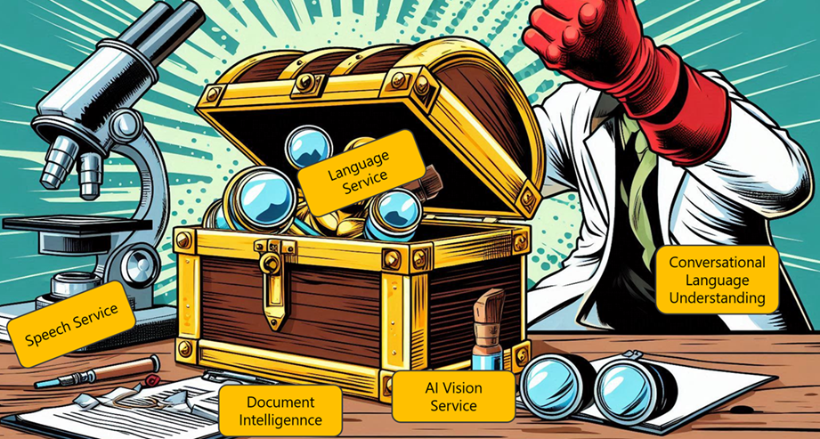
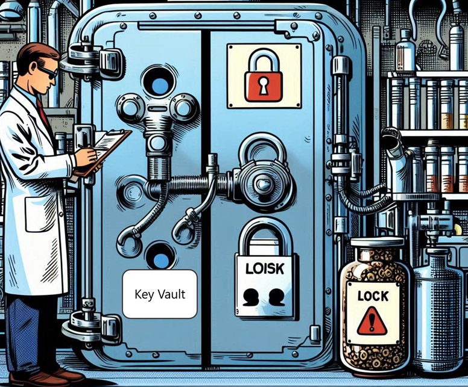

# Azure AI Services Adventure

## Introduction
In the futuristic city of Innovatia, a group of brilliant data scientists and tech enthusiasts are on a mission to harness the power of Azure AI services to solve complex problems and drive innovation. Led by Dr. Alice, a renowned data scientist, the team embarks on an exciting expedition to explore and implement Azure AI solutions.

 

**Stage 1: The Discovery**
Dr. Alice and her team, including tech-savvy members like Bob, a cloud architect, and Helen, a machine learning expert, discover a hidden lab filled with data anomalies. They realize that these anomalies can be resolved using Azure AI services. The team decides to provision the necessary AI services on Azure to begin their investigation.

 

**Challenge:**: Provision an AI service on Azure

Reorder Sequence: Arrange the steps to provision an AI service on Azure in the correct order.

<ul id="sortable-setup" class="styled-list">
  
  <li class="ui-state-default" data-order="3">Select "Create a resource".</li>
  <li class="ui-state-default" data-order="1">Choose the AI service (e.g., Computer Vision)</li>
  <li class="ui-state-default" data-order="2">Configure the service settings (e.g., region, pricing tier)</li>
  <li class="ui-state-default" data-order="4">Review and create the service</li>
  
</ul>

<button onclick="checkOrderSetup()">Check Order</button>
<button onclick="helpMeSetup()">Help me</button>

<link rel="stylesheet" href="https://code.jquery.com/ui/1.12.1/themes/base/jquery-ui.css">

**Stage 2: Securing the Lab**
To ensure the security of their AI services, the team sets up endpoints and keys. They also decide to use Azure Key Vault to store their secrets securely, protecting their data from potential breaches.

 

**Challenge**: Store keys in Azure Key Vault.

What is the primary purpose of Azure Key Vault?

<form id="quizForm">
  <input type="radio" id="q1" name="answer" value="q1">
  <label for="a1"> To store and manage secrets, keys, and certificates securely</label> 
  <input type="radio" id="q2" name="answer" value="q2">
  <label for="a2">To provision AI services</label> 
  <input type="radio" id="q3" name="answer" value="q3">
  <label for="a3">To analyze images and extract information</label> 
  <input type="radio" id="q4" name="answer" value="q4">
  <label for="a4">To convert spoken language into text</label> 
  <button type="button" onclick="checkAnswer()" class="styled-button">Submit</button>
</form>

Reorder Sequence: Arrange the steps to store a key in Azure Key Vault in the correct order.

<ul id="sortable-setup1" class="styled-list">  
  <li class="ui-state-default" data-order="1">Create a new key vault</li>
  <li class="ui-state-default" data-order="3">Add a new secret to the key vault</li>
  <li class="ui-state-default" data-order="2">Retrieve the key from the AI service</li>
  <li class="ui-state-default" data-order="4">Store the key as a secret in the key vault</li>
  
</ul>

<button onclick="checkOrderSetup1()">Check Order</button>
<button onclick="helpMeSetup1()">Help me</button>

<link rel="stylesheet" href="https://code.jquery.com/ui/1.12.1/themes/base/jquery-ui.css">

**Stage 3: The Breakthrough**
As the team delves deeper into the data, they uncover groundbreaking insights that could revolutionize the field of data science. They present their findings to the Innovatia Council, showcasing the power and potential of Azure AI services.

**Challenge**: Present the findings using Azure AI services.

Where can you find the endpoint URL and keys for your Azure AI service?"

<form id="quizForm1">
  <input type="radio" id="q1" name="answer2" value="q1">
  <label for="a1"> In the Azure portal under the resource's 'Keys and Endpoint' section</label> 
  <input type="radio" id="q2" name="answer2" value="q2">
  <label for="a2">In the Azure Marketplace</label> 
  <input type="radio" id="q3" name="answer2" value="q3">
  <label for="a3">In the Azure CLI</label> 
  <input type="radio" id="q4" name="answer2" value="q4">
  <label for="a4">In the Azure documentation</label> 
  <button type="button" onclick="checkAnswer2()" class="styled-button">Submit</button>
</form>

The Innovatia Council is impressed with the team's discoveries and the innovative use of Azure AI services. Dr. Alice and her team are celebrated as pioneers in the field of data science, inspiring others to explore and implement Azure AI solutions.
