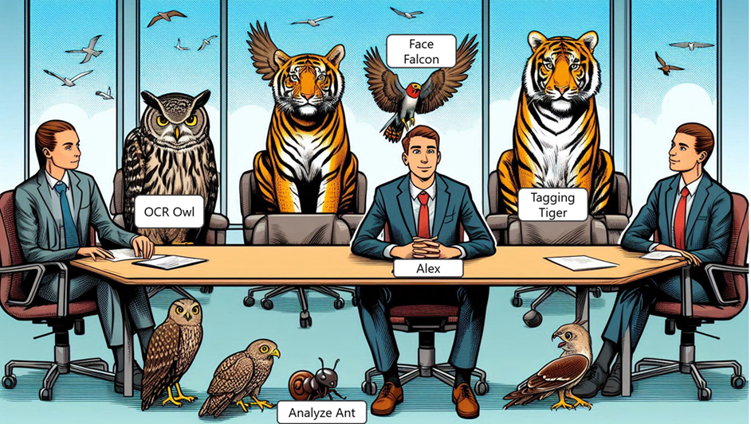
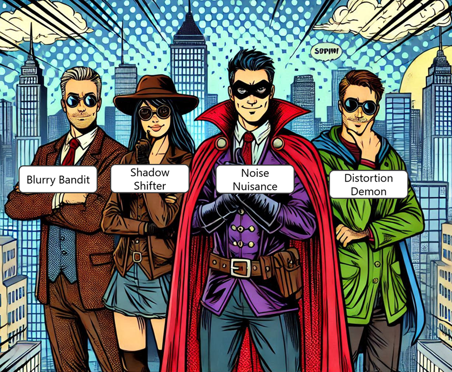

# Quest with AI Vision

## Introduction

Meet Alex, a tech-savvy hero who loves solving problems with cutting-edge technology. Alex is on a mission to help the city of Techville, which is facing various challenges that can be solved using Azure AI Vision Service. Alex is joined by a team of sidekicks, each representing a feature of Azure AI Vision Service:

**OCR Owl:** A wise owl who can read and extract text from any image. 
**Tagging Tiger:** A fierce tiger who can identify and tag objects in images. 
**Face Falcon:** A sharp-eyed falcon who can detect and analyze faces. 
**Analyze Ant:** A diligent ant who can analyze image content and provide insights.

 

The city is threatened by a group of villains, each representing a challenge:

**Blurry Bandit:** Causes images to be blurry and hard to analyze. 
**Shadow Shifter:** Creates shadows that obscure important details in images. 
**Noise Nuisance:** Adds random noise to images, making them difficult to process. 
**Distortion Demon:** Warps images, making it hard to recognize objects. 

 

### First Challenge: The Blurry Bandit
Alex and OCR Owl encounter their first challenge. The Blurry Bandit has struck, making important documents unreadable. OCR Owl uses its Optical Character Recognition (OCR) powers to extract text from the blurry images.

**Which Azure AI Vision Service feature did OCR Owl use to read the text from the blurry images**

<form id="quizForm1">
  <input type="radio" id="q1a" name="q1" value="A">
  <label for="q1a">A. Image Tagging</label> 
  <input type="radio" id="q1b" name="q1" value="B">
  <label for="q1b">B. Face Detection</label> 
  <input type="radio" id="q1c" name="q1" value="C">
  <label for="q1c">C. Optical Character Recognition (OCR)</label> 
  <input type="radio" id="q1d" name="q1" value="D">
  <label for="q1d">D. Image Analysis</label> 
  <button type="button" onclick="checkAnswer1()" class="styled-button">Submit</button>
</form>

### Second Challenge: The Shadow Shifter
Next, Alex and Tagging Tiger face the Shadow Shifter, who has cast shadows over surveillance footage. Tagging Tiger uses its image tagging abilities to identify objects despite the shadows.

**How did Tagging Tiger identify objects in shadowy images?**

<form id="quizForm2">
  <input type="radio" id="q2a" name="q2" value="A">
  <label for="q2a">A. Face Detection</label> 
  <input type="radio" id="q2b" name="q2" value="B">
  <label for="q2b">B. Image Tagging</label> 
  <input type="radio" id="q2c" name="q2" value="C">
  <label for="q2c">C. Text Extraction</label> 
  <input type="radio" id="q2d" name="q2" value="D">
  <label for="q2d">D. Image Analysis</label> 
  <button type="button" onclick="checkAnswer2()" class="styled-button">Submit</button>
</form>

### Final Challenge: The Distortion Demon
In the final showdown, Alex and the team confront the Distortion Demon, who has warped images of missing persons. Face Falcon uses its face detection and analysis powers to recognize and analyze the faces, helping to locate the missing individuals.

**Which feature did Face Falcon use to recognize and analyze faces in distorted images?**

<form id="quizForm3">
  <input type="radio" id="q3a" name="q3" value="A">
  <label for="q3a">A. Image Tagging</label> 
  <input type="radio" id="q3b" name="q3" value="B">
  <label for="q3b">B. Face Detection</label> 
  <input type="radio" id="q3c" name="q3" value="C">
  <label for="q3c">C. Optical Character Recognition (OCR)</label> 
  <input type="radio" id="q3d" name="q3" value="D">
  <label for="q3d">D. Image Analysis</label> 
  <button type="button" onclick="checkAnswer3()" class="styled-button">Submit</button>
</form>

